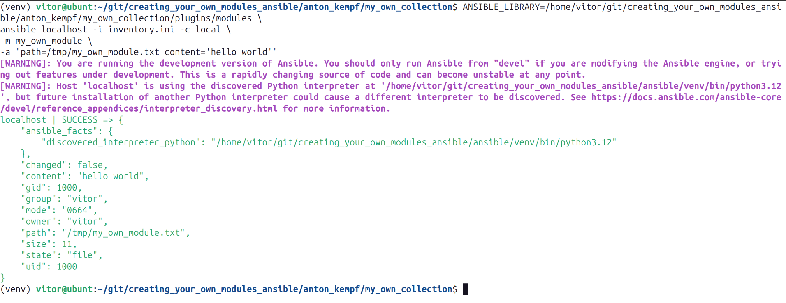
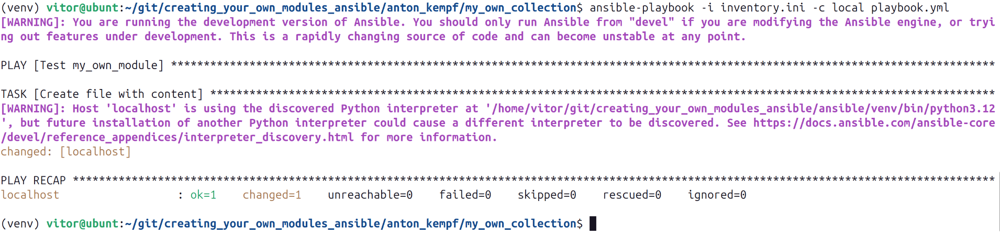
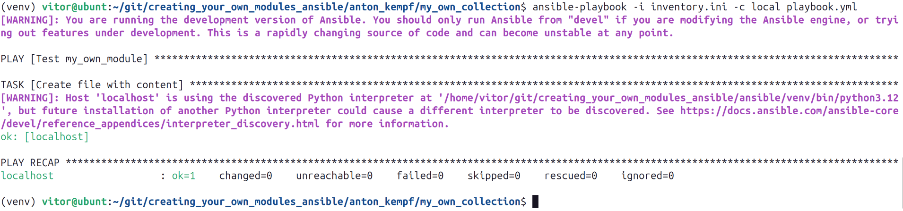
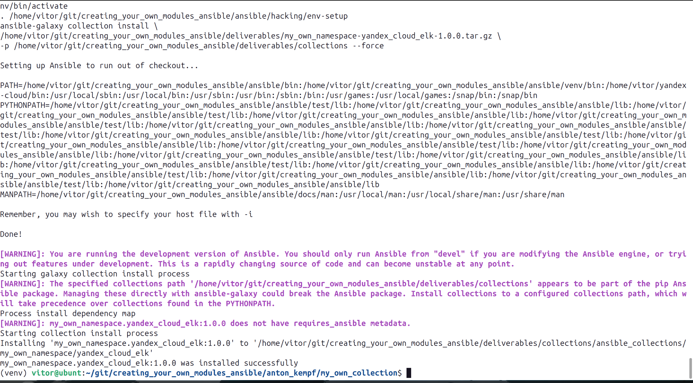
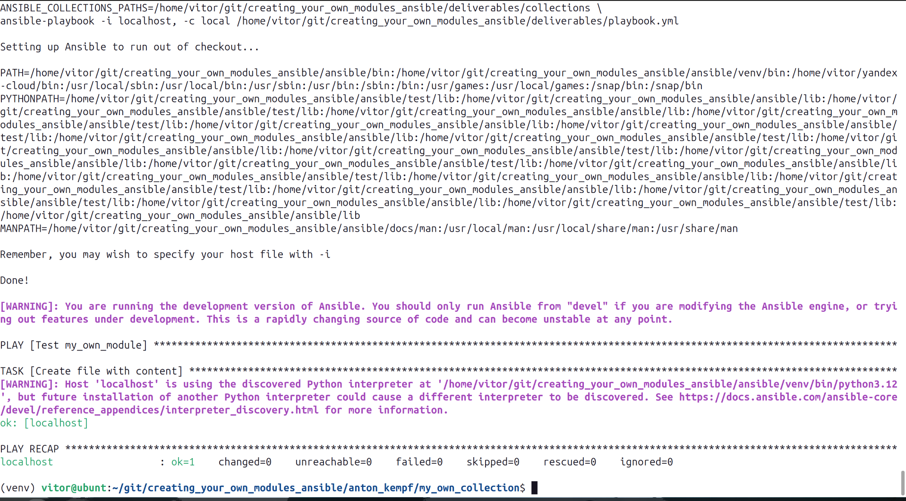

# Скриншоты по пунктам

Пункт 4 — проверка модуля локально

Пункт 6 — проверка идемпотентности (1-й запуск, changed=1)

Пункт 6 — проверка идемпотентности (2-й запуск, changed=0)

Пункт 15 — установка коллекции из архива

Пункт 16 — запуск playbook с установленной коллекцией

